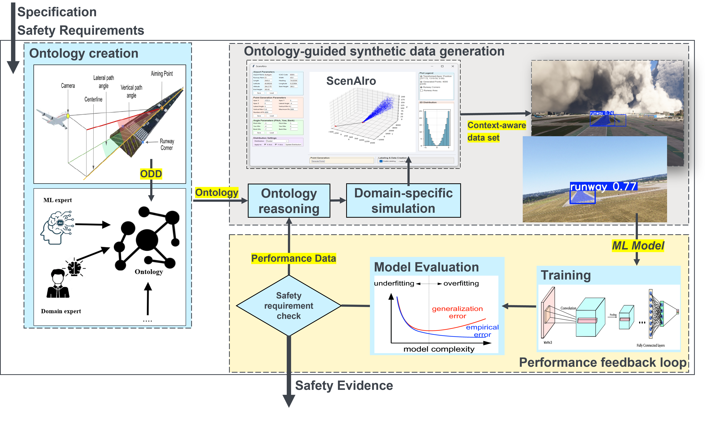

# OSCAR — Ontology-driven SynthetiC data generation for sAfe and Robust CNN for Runway identification

**OSCAR** is an automated closed-loop framework that uses ontology-based reasoning to guide synthetic data augmentation for CNN training in runway identification during landing approach. By integrating SWRL rule-based weakness inference and SPARQL-driven knowledge extraction into the training cycle, OSCAR systematically diagnoses CNN failures, identifies misclassification root causes, and generates targeted training data — shifting data augmentation from stochastic trial-and-error to a deterministic, semantically grounded engineering discipline.

<p align="center">
  
</p>

## Motivation

Existing data augmentation approaches for safety-critical perception systems suffer from three core gaps:

1. **Lack of semantic guidance** — Domain-agnostic parameter treatment provides no principled basis for *what* to generate.
2. **Disconnection between coverage and safety** — No automated feedback determines *when* to generate, leaving failure-prone regions undersampled.
3. **Absence of traceability** — No linkage exists between generated data and diagnosed model weaknesses, making it impossible to explain *why* data was produced.

OSCAR addresses all three through an ontology-based closed-loop architecture where a Pellet reasoner infers CNN weaknesses via SWRL rules, SPARQL queries extract tiered augmentation directives, and an iteration controller orchestrates the feedback cycle until convergence.

## Architecture

The framework operates through seven stages per iteration, orchestrated by an external Iteration Controller:

| Stage | Component | Function | Script |
|:-----:|-----------|----------|--------|
| ① | **CNN Model** | Train/evaluate CNN on cumulative dataset | `OSCAR_CNN.py` |
| ② | **Ontology Manager** | Populate OWL 2 DL ontology with CNN results | `OSCAR_Management.py` |
| ③ | **Ontology Rule Engine** | Execute 44 SWRL rules for weakness inference | `OSCAR_Rule.py` |
| ④ | **Ontology Query System** | Run 8 SPARQL queries with tiered allocation | `OSCAR_Query.py` |
| ⑤ | **Dataset Generator** | Generate ontology-guided ScenAIro JSON configs | `OSCAR_DatasetGenerator.py` |
| ⑥ | **ScenAIro + MSFS** | Render photorealistic runway images (manual) | — |
| ⑦ | **Dataset Enhancement** | Integrate generated images into training set | `OSCAR_IterationController.py` |

Stages ①–⑤ execute automatically. Stage ⑥ requires manual rendering in ScenAIro using Microsoft Flight Simulator. Stage ⑦ feeds generated images back into the dataset, completing the iteration cycle. The loop terminates when SPARQL query Q15 returns `STOP_EXCELLENCE` (test accuracy ≥ 100%) or the safety limit is reached.

### Tiered Allocation Strategy

Augmentation resources are allocated according to failure severity:

| Tier | Priority | Source Query | Allocation |
|:----:|----------|-------------|:----------:|
| 1 | Co-occurrence weaknesses | Q14 | 60% |
| 2 | Critical high-confidence errors | Q21 | 20% |
| 3 | Single-dimension weaknesses | Q13 | 15% |
| 4 | ODD coverage gaps | Q8 | 5% |

## Operational Design Domain

OSCAR operates over a 3-dimensional ODD with 28 unique combinations:

- **Runway type** (2): `runway`, `norunway`
- **Airport** (7): EDDS (Stuttgart), EDDV (Hannover), EDNY (Friedrichshafen), EDSB (Karlsruhe), ELLX (Luxembourg), ENBR (Bergen), KLAX (Los Angeles)
- **Time of day** (2): daytime (10:00–15:00), nighttime (00:00–05:00)

## Key Results

OSCAR achieves **100% test accuracy** in **4 iterations** versus 9 for the random baseline — a **55.6% reduction** in augmentation cycles. Across three seeds (42, 61, 116), the ontology-guided approach shows zero variance (±0.00%) at convergence. Systematic error elimination reduces co-occurrence weaknesses from 16 to 0 over the iteration sequence.

## Repository Structure

```
OSCAR/
├── OSCAR_IterationController.py     # Main entry point — orchestrates the closed loop
├── OSCAR_CNN.py                     # CNN training, evaluation, and metrics export
├── OSCAR_Management.py              # Ontology population (T-Box + A-Box construction)
├── OSCAR_Rule.py                    # 44 SWRL rules (6 categories) for weakness inference
├── OSCAR_Query.py                   # 8 SPARQL queries with tiered allocation
├── OSCAR_DatasetGenerator.py        # Ontology-guided ScenAIro JSON generation
├── OSCAR_Random_JSONGenerator.py    # Random baseline JSON generation (fair comparison)
├── OSCAR_Wish_DatasetGenerator.py   # Source pool generation (ontology-guided)
├── OSCAR_Wish_randomDatasetGenerator.py  # Source pool generation (random baseline)
├── OSCAR_Rename_Images.py           # Post-rendering filename normalization
├── OSCAR_visualize_performance.py   # Performance visualization and comparison plots
├── Ontology_OWL_files/              # Generated OWL 2 DL ontologies per iteration/seed
├── Ontology_Input_Individuals/      # Initial training data and CNN metric exports
│   └── input_image/
│       ├── train/                   # Training images (runway/ and norunway/)
│       ├── val/                     # Validation images
│       └── test/                    # Test images
├── OSCAR_Experiments/               # Experiment outputs organized by seed
│   └── seed_{XX}/
│       ├── Ontology/datasets/       # Ontology-guided augmentation datasets per iteration
│       └── Random/datasets/         # Random baseline datasets per iteration
├── CNN_Models/                      # Saved model weights (.h5) per iteration/seed
├── query_result/                    # SPARQL query results (JSON) per iteration/seed
└── Figures/                         # Architecture diagrams and result plots
```

## Requirements

- **Python** ≥ 3.10
- **Owlready2** ≥ 0.46 (with bundled Pellet reasoner)
- **TensorFlow** ≥ 2.15
- **Java** ≥ 8 (required by Pellet reasoner)
- **ScenAIro** + **Microsoft Flight Simulator 2020** (for manual image rendering in Stage ⑥)

### Python Dependencies

```
owlready2>=0.46
tensorflow>=2.15
numpy
scikit-learn
matplotlib
seaborn
tqdm
```

Install with:

```bash
pip install owlready2 tensorflow numpy scikit-learn matplotlib seaborn tqdm
```

## Usage

### Running a Full Experiment (Single Seed)

```bash
# Run iterations 1 through 10 with seed 42
python OSCAR_IterationController.py --start 1 --end 10 --seed 42
```

Each iteration executes Stages ①–⑤ automatically. After Stage ⑤ generates JSON configurations, pause to manually render images in ScenAIro + MSFS, then resume:

```bash
# Resume from iteration 2 after manual rendering
python OSCAR_IterationController.py --start 2 --end 10 --seed 42
```

### Running a Multi-Seed Experiment

```bash
# Run all three experimental seeds
python OSCAR_IterationController.py --start 1 --end 10 --seeds 42 61 116
```

### Running Individual Stages

```bash
# Stage 1: CNN Training
python OSCAR_CNN.py --start 1 --seed 42 --epochs 30

# Stage 2: Ontology Population
python OSCAR_Management.py --iteration 1 --seeds 42

# Stage 3: SWRL Rules
python OSCAR_Rule.py --iteration 1 --seeds 42

# Stage 4: SPARQL Queries
python OSCAR_Query.py --iteration 1 --seeds 42

# Stage 5: Dataset Generation
python OSCAR_DatasetGenerator.py --iteration 1 --seeds 42
```

### Generating Random Baseline

```bash
# Generate random JSON files for comparison
python OSCAR_Random_JSONGenerator.py --iteration 1 --seed 42
```

### Visualizing Results

```bash
python OSCAR_visualize_performance.py --seed 42
```

### Post-Rendering Image Renaming

ScenAIro may append `_from_json` to rendered filenames. To normalize:

```bash
python OSCAR_Rename_Images.py --iteration 1 --seed 42
# Or process all at once:
python OSCAR_Rename_Images.py --all
```

## Configuration

Key experiment parameters are defined in `OSCAR_IterationController.py`:

| Parameter | Default | Description |
|-----------|---------|-------------|
| `epochs` | 30 | Training epochs per iteration |
| `batch_size` | 32 | CNN batch size |
| `learning_rate` | 0.001 | Initial learning rate |
| `base_percentage` | 0.08 | Augmentation budget (8% of cumulative training size) |
| `min_images` | 5 | Minimum images per augmentation iteration |
| `max_images` | 100 | Maximum images per augmentation iteration |
| `max_iterations` | 1000 | Safety limit for loop termination |

## Semantic Stack

| Technology | Role |
|------------|------|
| OWL 2 DL | Knowledge representation (T-Box schema + A-Box instances) |
| SWRL | 44 rules across 6 categories for weakness inference |
| SPARQL | 8 queries in tiered architecture for knowledge extraction |
| Pellet | DL reasoner with SWRL support (via Owlready2) |
| Owlready2 | Python interface for ontology-oriented programming |

## CNN Architecture

The OSCAR CNN accepts 100×100×3 RGB images and outputs a binary classification (runway vs. no-runway). The architecture consists of two convolutional blocks followed by fully connected layers, totaling 338,113 trainable parameters. Training uses the Adam optimizer with binary cross-entropy loss.

## Ontology Details

The OSCAR ontology uses OWL 2 DL expressivity (ALCIF(D)) and is constructed programmatically via Owlready2. Each iteration populates a new A-Box with CNN classification results, while the T-Box schema remains stable across iterations. The 44 SWRL rules are organized into six categories: misclassification detection (1 rule), runway classification weaknesses (2 rules), airport weaknesses (7 rules), time-of-day weaknesses (2 rules), co-occurrence weaknesses (28 rules), and training state detection (4 rules).

## Related Standards

OSCAR is designed with awareness of aviation safety certification standards including DO-178C (software considerations in airborne systems), ARP4754A (development of civil aircraft and systems), and the EASA AI Roadmap for machine learning applications in aviation.

## Authors

Dr.Yassine Akhiat, Xiaowei Zhu, Prof. Dr.-Ing.Zamira Daw Institute of Aircraft Systems (ILS), University of Stuttgart

# License
Apache License 2.0 — free for research and commercial use, with explicit patent grants for contributors and users.